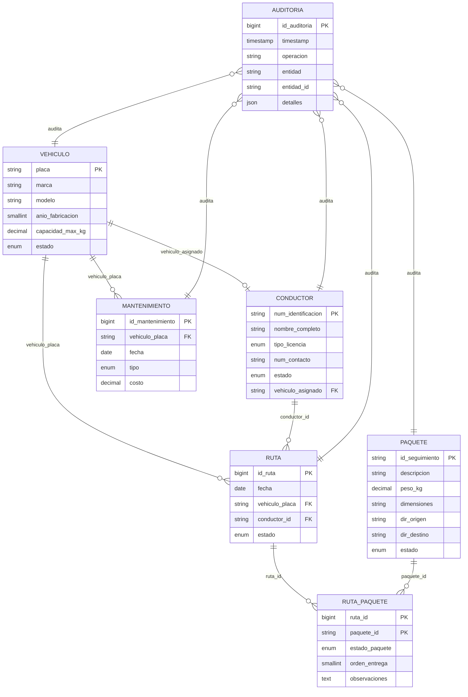

[README.md](https://github.com/user-attachments/files/31809185/README.md)
# RapidExpress - Sistema de Gestión de Flotas, Rutas y Paquetería

[](https://www.oracle.com/java/)
[](https://www.mysql.com/)
[](https://maven.apache.org/)
[](https://en.wikipedia.org/wiki/Model%E2%80%93view%E2%80%93controller)

Sistema backend robusto con interfaz de línea de comandos (CLI) diseñado para centralizar, automatizar y optimizar la administración integral de flotas de vehículos, conductores, inventario de paquetes en bodega, programación y monitoreo en tiempo real de hojas de ruta, mantenimiento preventivo/correctivo y auditoría transaccional para la empresa de logística y mensajería **RapidExpress**.

---

## Tabla de Contenidos

1. [Descripción del Proyecto](#descripción-del-proyecto)
2. [Características Principales](#características-principales)
3. [Tecnologías Utilizadas](#tecnologías-utilizadas)
4. [Arquitectura del Sistema](#arquitectura-del-sistema)
5. [Diseño de la Base de Datos](#diseño-de-la-base-de-datos)
   - [Modelo Relacional y Normalización](#modelo-relacional-y-normalización)
   - [Diagrama Entidad-Relación (ERD)](#diagrama-entidad-relación-erd)
   - [Inventario de Tablas y Vistas](#inventario-de-tablas-y-vistas)
6. [Instalación y Ejecución](#instalación-y-ejecución)
   - [Requisitos Previos](#requisitos-previos)
   - [Clonación del Repositorio](#clonación-del-repositorio)
   - [Configuración de la Base de Datos (Cloud / Local)](#configuración-de-la-base-de-datos-cloud--local)
   - [Configuración de Credenciales](#configuración-de-credenciales)
   - [Compilación y Ejecución](#compilación-y-ejecución)
7. [Guía de Uso del Sistema (CLI)](#guía-de-uso-del-sistema-cli)
   - [Estructura de Menús](#estructura-de-menús)
   - [Flujos de Operación Representativos](#flujos-de-operación-representativos)
   - [Módulo de Auditoría y Trazabilidad](#módulo-de-auditoría-y-trazabilidad)
8. [Estructura del Proyecto](#estructura-del-proyecto)
9. [Autores](#autores)

---

## Descripción del Proyecto

En el contexto operativo de **RapidExpress**, la gestión manual mediante hojas de cálculo provocaba retrasos en entregas, sobrecarga no controlada en los vehículos, asignaciones indebidas de personal y carencia de visibilidad en tiempo real del ciclo de vida de los envíos.

Este sistema soluciona dichas problemáticas mediante una solución de software de arquitectura limpia bajo el patrón **Modelo-Vista-Controlador (MVC)** que garantiza:
- Control estricto de la capacidad volumétrica y peso máximo de cada vehículo frente a la carga asignada en ruta.
- Validación de relaciones exclusivas (1:1) entre conductores activos y vehículos disponibles.
- Seguimiento de estados atómicos en el ciclo de vida de los paquetes (`En_Bodega` $\rightarrow$ `Asignado_Ruta` $\rightarrow$ `En_Transito` $\rightarrow$ `Entregado` / `Devuelto`).
- Bitácora inmutable de auditoría transaccional persistida tanto en base de datos relacional como en archivos de log locales.
- Generación y exportación de reportes operacionales detallados (rendimiento de conductores, historial vehicular, costos de talleres mecánicos).

---

## Características Principales

- **Gestión de Parque Automotor**: Registro, actualización, cambio de estado (`Disponible`, `En_Ruta`, `En_Mantenimiento`) y consulta de métricas de flota con restricciones de año [1990-2030] y capacidad $>0\text{ kg}$.
- **Gestión de Personal de Conducción**: Administración de conductores con categorías de licencia (`A`, `B`, `C`, `D`, `E`), asignación/liberación exclusiva de vehículos y gestión de disponibilidad (`Activo`, `En_Ruta`, `De_Vacaciones`, `Inactivo`).
- **Control de Paquetería y Envíos**: Generación de códigos únicos de seguimiento (`PKG-YYYYMMDD-XXX` / UUID), almacenamiento de dimensiones ($L\times W\times H$), pesos, remitentes y destinatarios completos.
- **Despacho y Seguimiento de Rutas**: Creación de hojas de ruta diarias con validación automática de sobrecupo (la suma de los pesos de los paquetes no puede exceder la capacidad del camión), orden de parada secuencial y transición coordinada de estados de vehículos, conductores y paquetes.
- **Mantenimientos y Control de Costos**: Historial por vehículo clasificado en `Preventivo`, `Correctivo` e `Inspeccion`, kilometraje, costos acumulados y control de talleres autorizados.
- **Reportes y Auditoría**: Cálculo de efectividad de entrega por conductor, historial de carga transportada, métricas financieras de talleres mecánicos y registro de auditoría en formato JSON con marcas de tiempo en milisegundos.

---

## Tecnologías Utilizadas

| Categoría | Tecnología / Herramienta | Versión | Propósito |
| :--- | :--- | :--- | :--- |
| **Lenguaje** | Java (OpenJDK) | 17 LTS | Lógica de negocio y backend CLI |
| **Persistencia** | MySQL Server | 8.0+ | Base de datos relacional (alojada en servidor Cloud) |
| **Driver JDBC** | `com.mysql:mysql-connector-j` | 8.3.0 | Conectividad Java-MySQL con soporte SPI |
| **Build Tool** | Apache Maven | 3.8+ | Gestión de dependencias y ciclo de vida del proyecto |
| **Testing** | JUnit 5 (Jupiter) | 5.10.2 | Pruebas unitarias de servicios y validadores |
| **Gestión DB** | CloudBeaver / DBeaver | - | Administración, ejecución de DDL/DML y consultas |
| **Control Versiones**| Git & GitHub | - | Gestión de ramas (`main`, `develop`, `feature/*`) y commits semánticos |

---

## Arquitectura del Sistema

El proyecto aplica una arquitectura en capas basada en **MVC (Model-View-Controller)** con desacoplamiento mediante **Data Access Objects (DAO)** y **Service Layer**:

```
                              ┌────────────────────────┐
                              │     Consola (CLI)      │
                              └───────────┬────────────┘
                                          │ Entrada / Salida
                                          ▼
┌─────────────────────────────────────────────────────────────────────────────────┐
│ CAPA DE VISTA (com.RapidExpress.view)                                           │
│ MainMenuView, VehiculoView, ConductorView, PaqueteView, RutaView, etc.          │
│ Componente transversal: ConsoleUtil (tablas formateadas, lectura segura)        │
└─────────────────────────────────────────┬───────────────────────────────────────┘
                                          │ DTOs / Comandos
                                          ▼
┌─────────────────────────────────────────────────────────────────────────────────┐
│ CAPA CONTROLADORA (com.RapidExpress.controller)                                 │
│ VehiculoController, ConductorController, RutaController, ReporteController, etc.│
└─────────────────────────────────────────┬───────────────────────────────────────┘
                                          │ Invoca casos de uso
                                          ▼
┌─────────────────────────────────────────────────────────────────────────────────┐
│ CAPA DE SERVICIO (com.RapidExpress.service)                                     │
│ VehiculoService, ConductorService, RutaService, ReporteService, etc.            │
│ Validaciones de negocio, restricciones de peso, transiciones de estado          │
└───────────────────┬─────────────────────────────────────────┬───────────────────┘
                    │                                         │
                    ▼                                         ▼
┌────────────────────────────────────────┐ ┌──────────────────────────────────────┐
│ CAPA DAO (com.RapidExpress.dao)        │ │ CAPA DE MODELO                       │
│ VehiculoDAO, ConductorDAO, RutaDAO...  │ │ (com.RapidExpress.model.entity/enums)│
│ Consultas SQL seguras (PreparedStatement)│ │ Vehiculo, Conductor, Paquete, Ruta...│
└───────────────────┬────────────────────┘ └──────────────────────────────────────┘
                    │ JDBC Connection
                    ▼
┌────────────────────────────────────────┐
│ CONFIGURACIÓN (DatabaseConnection)     │
│ Fallback a variables de entorno / JVM  │
└───────────────────┬────────────────────┘
                    │ TCP / Port 3306
                    ▼
┌────────────────────────────────────────┐
│ SERVIDOR MYSQL REMOTO (Esquema RAPIDD) │
└────────────────────────────────────────┘
```

---

## Diseño de la Base de Datos

### Modelo Relacional y Normalización
La base de datos relacional `RAPIDD` fue diseñada bajo las formas normales **1NF, 2NF, 3NF, BCNF y 4NF**:
- **Atomicidad y Claves Primarias**: Claves naturales para identificadores de negocio (`vehiculo.placa`, `conductor.num_identificacion`, `paquete.id_seguimiento`) y claves subrogadas (`BIGINT AUTO_INCREMENT`) para transacciones (`ruta`, `mantenimiento`, `auditoria`).
- **Integridad Referencial y Cascada**: Asignación `1:1` opcional entre conductor y vehículo protegida por restricción `UNIQUE (vehiculo_asignado)`. La tabla puente `ruta_paquete` resuelve la relación `N:M` con integridad `CASCADE` en rutas y `RESTRICT` en paquetes.
- **Restricciones de Dominio (Check & Enum)**: Tipos `ENUM` para máquinas de estado y restricciones `CHECK` para validar que capacidades, años de fabricación, costos y pesos se mantengan estrictamente positivos y en rangos válidos.

### Diagrama Entidad-Relación (ERD)


#### Diagrama de Relaciones Mermaid



### Inventario de Tablas y Vistas

| Objeto | Tipo | Descripción | Registros Iniciales (DML) |
| :--- | :--- | :--- | :--- |
| **`vehiculo`** | Tabla | Parque automotor de la empresa | 25 registros |
| **`conductor`** | Tabla | Personal de conductores y asignación de flota | 25 registros |
| **`paquete`** | Tabla | Envíos registrados con remitente y destinatario | 60 registros |
| **`ruta`** | Tabla | Hojas de ruta de distribución diaria | 20 registros |
| **`ruta_paquete`**| Tabla | Tabla puente N:M para carga y orden de paradas | 60 registros |
| **`mantenimiento`**| Tabla | Historial de mantenimientos, costos y talleres | 25 registros |
| **`auditoria`** | Tabla | Bitácora inmutable de operaciones críticas | 20 registros |
| **`v_ruta_detalle`**| Vista | Detalle consolidado de rutas con conteos y peso total | Consulta dinámica |
| **`v_vehiculo_estado`**| Vista| Estado del vehículo con conductor asignado y rutas activas | Consulta dinámica |

---

## Instalación y Ejecución

### Requisitos Previos

1. **Java Development Kit (JDK)**: Versión 17 o superior instalada (`java -version`).
2. **Apache Maven**: Versión 3.8+ instalada (`mvn -version`).
3. **Servidor MySQL**: MySQL Server 8.0+ en la nube o local con puerto `3306` accesible.
4. **Git**: Cliente Git para clonación y control de versiones.

### Clonación del Repositorio

```bash
git clone https://github.com/Alter-09/RapidExpress.git
cd RapidExpress
```

### Configuración de la Base de Datos (Cloud / Local)

El proyecto incluye los scripts de definición de datos y carga inicial ubicados en la carpeta `database/`:

1. **Creación del Esquema y Tablas (DDL)**:
   Ejecute el script `database/1_schema_ddl.sql` en su cliente MySQL (CloudBeaver, DBeaver, MySQL Workbench o consola CLI):
   ```bash
   mysql -h <HOST_DB> -u <USUARIO_DB> -p < database/1_schema_ddl.sql
   ```

2. **Carga de Datos Iniciales (DML)**:
   Ejecute el script `database/2_data_dml.sql` para poblar las tablas con los conjuntos de datos de prueba:
   ```bash
   mysql -h <HOST_DB> -u <USUARIO_DB> -p < database/2_data_dml.sql
   ```

### Configuración de Credenciales

La clase `DatabaseConnection.java` ubicada en `src/main/java/com/RapidExpress/config/DatabaseConnection.java` permite configurar las credenciales directamente o mediante variables de entorno del sistema operativo:

#### Opción A: Variables de Entorno (Recomendado para Producción)
```bash
# En Windows (PowerShell / CMD):
set DB_HOST=localhost | localhost
set DB_PORT=3306
set DB_NAME=RAPIDD
set DB_USER=root
set DB_PASSWORD=TuPasswordAqui

# En Linux / macOS:
export DB_HOST=localhost
export DB_PORT=3306
export DB_NAME=RAPIDD
export DB_USER=root
export DB_PASSWORD=TuPasswordAqui
```

#### Opción B: Archivo de Configuración Local
Si prefiere configurar el archivo localmente, use la plantilla `DatabaseConnection.example.java`:
```bash
cp src/main/java/com/RapidExpress/config/DatabaseConnection.example.java src/main/java/com/RapidExpress/config/DatabaseConnection.java
```
Edite los valores de `URL`, `USER` y `PASSWORD` según corresponda. (Nota: `DatabaseConnection.java` está protegido en `.gitignore`).

### Compilación y Ejecución

1. **Compilar el proyecto y descargar dependencias**:
   ```bash
   mvn clean compile
   ```

2. **Ejecutar la suite de pruebas unitarias**:
   ```bash
   mvn test
   ```

3. **Iniciar la aplicación CLI**:
   ```bash
   # Mediante Maven Exec Plugin:
   mvn exec:java -Dexec.mainClass="com.RapidExpress.Main"

   # O empaquetando el JAR y ejecutando:
   mvn package
   java -cp "target/RapidExpress-1.0-SNAPSHOT.jar;target/dependency/*" com.RapidExpress.Main
   ```

---

## Guía de Uso del Sistema (CLI)

Al iniciar la aplicación, se mostrará el encabezado interactivo y la verificación del estado de conexión a la base de datos MySQL.

### Estructura de Menús

```text
================================================================================
  RapidExpress - Sistema de Gestion de Flotas y Rutas
================================================================================
Conexión exitosa a la base de datos MySQL [RAPIDD].

================================================================================
  MENU PRINCIPAL
================================================================================
1. Gestion de vehiculos
2. Gestion de conductores
3. Gestion de paquetes
4. Gestion de rutas
5. Gestion de mantenimientos
6. Reportes
0. Salir
================================================================================
Seleccione una opcion: 
```

### Flujos de Operación Representativos

#### 1. Registrar y Asignar un Conductor a un Vehículo
1. Ingrese a la opción `1. Gestion de vehiculos` $\rightarrow$ `1. Registrar vehiculo`.
2. Ingrese Placa (`ABC-150`), Marca (`Chevrolet`), Modelo (`FVR Forward`), Año (`2022`) y Capacidad máxima (`12000.00`).
3. Vuelva al menú principal e ingrese a `2. Gestion de conductores` $\rightarrow$ `1. Registrar conductor`.
4. Digite Identificación (`1000000030`), Nombre (`Mateo Valencia`), Licencia (`C`) y Teléfono (`3009988776`).
5. En el menú de conductores seleccione `6. Asignar vehiculo`, digite el ID del conductor y la placa `ABC-150`. El sistema verificará que el vehículo esté `Disponible` y creará el vínculo exclusivo.

#### 2. Planificar y Despachar una Hoja de Ruta
1. Ingrese a `4. Gestion de rutas` $\rightarrow$ `1. Crear ruta`.
2. Ingrese la fecha (`dd/MM/yyyy`), placa del vehículo (`ABC-125`) y el ID del conductor asignado (`1000000003`).
3. Seleccione los paquetes en estado `En_Bodega` a cargar en la ruta. El sistema sumará los pesos de los paquetes en tiempo real; si la suma excede la capacidad del vehículo, la asignación será rechazada por sobrecupo.
4. Seleccione `6. Iniciar ruta`. Automáticamente:
   - El estado de la ruta pasa a `En_Curso`.
   - El vehículo pasa a estado `En_Ruta`.
   - El conductor pasa a estado `En_Ruta`.
   - Los paquetes asignados pasan a estado `En_Transito`.

#### 3. Actualizar Entregas y Finalizar Ruta
1. Durante el recorrido, ingrese a la gestión de rutas para marcar paquetes individuales como `Entregado` o `Devuelto` con sus respectivas observaciones.
2. Al finalizar la jornada, ejecute `7. Completar ruta`. Los paquetes entregados se archivan satisfactoriamente y el vehículo y conductor retornan a estado `Disponible`.

#### 4. Registrar Mantenimiento de Vehículo
1. Ingrese a `5. Gestion de mantenimientos` $\rightarrow$ `1. Registrar mantenimiento`.
2. Seleccione el vehículo (`ABC-140`), fecha, tipo (`Preventivo` o `Correctivo`), descripción del arreglo (`Cambio de pastillas de freno`), costo (`$650,000 COP`), kilometraje y taller proveedor.
3. El estado del vehículo cambiará a `En_Mantenimiento` si la intervención lo requiere.

#### 5. Generación de Reportes Operativos
1. Ingrese a `6. Reportes`.
2. Seleccione entre:
   - **Entregas por Conductor**: Filtre por rango de fechas para ver tasas de efectividad y resumen de paquetes entregados/devueltos.
   - **Historial de Rutas por Vehículo**: Peso total transportado acumulado y cantidad de despachos.
   - **Resumen General de Flota**: Conteo de unidades por estado operativo y capacidad total en kilogramos.
   - **Costos de Mantenimiento**: Desglose financiero por vehículo y taller.
3. El sistema permite visualizar el reporte formateado en consola y exportarlo automáticamente a la carpeta `logs/`.

### Módulo de Auditoría y Trazabilidad
Cada operación crítica (creación, edición, cambio de estado, despacho de ruta y entrega de paquete) dispara dos mecanismos simultáneos de registro:
1. **Persistencia en MySQL (`auditoria`)**: Se almacena la operación, entidad afectada, usuario responsable y los datos en formato `JSON`.
2. **Archivo Plano Local (`logs/audit.log`)**: Registro estructurado en texto para trazabilidad y auditorías forenses sin depender de la conectividad de red.

---

## Estructura del Proyecto

```text
rapidexpress-management-system/
├── .gitignore
├── pom.xml
├── README.md
├── Contexto.md
├── database/
│   ├── 1_schema_ddl.sql              # Definición de tablas, llaves, vistas y checks
│   ├── 2_data_dml.sql                # Poblado con +20 registros por entidad
│   ├── DIAGRAMA.md                   # Documentación detallada del modelo ER
│   ├── ER-DIAGRAM.png                # Imagen del Diagrama Entidad-Relación
│   ├── README.md                     # Guía técnica de la base de datos
│   └── variables_list.md             # Diccionario de variables y entorno
├── logs/
│   ├── audit.log                     # Bitácora local de eventos de auditoría
│   └── *.txt                         # Reportes operativos exportados
└── src/
    ├── main/
    │   └── java/
    │       └── com/
    │           └── RapidExpress/
    │               ├── Main.java     # Punto de entrada y loop del menú CLI
    │               ├── config/
    │               │   └── DatabaseConnection.java
    │               ├── controller/   # Controladores de flujo y orquestación
    │               │   ├── ConductorController.java
    │               │   ├── MantenimientoController.java
    │               │   ├── PaqueteController.java
    │               │   ├── ReporteController.java
    │               │   ├── RutaController.java
    │               │   └── VehiculoController.java
    │               ├── dao/          # Capa de acceso a datos JDBC (PreparedStatements)
    │               │   ├── AuditoriaDAO.java
    │               │   ├── ConductorDAO.java
    │               │   ├── MantenimientoDAO.java
    │               │   ├── PaqueteDAO.java
    │               │   ├── RutaDAO.java
    │               │   ├── RutaPaqueteDAO.java
    │               │   └── VehiculoDAO.java
    │               ├── model/
    │               │   ├── entity/   # Entidades del dominio (POJOs)
    │               │   │   ├── Auditoria.java
    │               │   │   ├── Conductor.java
    │               │   │   ├── Mantenimiento.java
    │               │   │   ├── Paquete.java
    │               │   │   ├── Ruta.java
    │               │   │   ├── RutaPaquete.java
    │               │   │   └── Vehiculo.java
    │               │   └── enums/    # Enumeraciones con valores de la base de datos
    │               │       ├── EstadoConductor.java
    │               │       ├── EstadoPaquete.java
    │               │       ├── EstadoRuta.java
    │               │       ├── EstadoRutaPaquete.java
    │               │       ├── EstadoVehiculo.java
    │               │       ├── TipoLicencia.java
    │               │       └── TipoMantenimiento.java
    │               ├── service/      # Capa de lógica y reglas de negocio
    │               │   ├── AuditoriaService.java
    │               │   ├── ConductorService.java
    │               │   ├── MantenimientoService.java
    │               │   ├── PaqueteService.java
    │               │   ├── ReporteService.java
    │               │   ├── RutaService.java
    │               │   └── VehiculoService.java
    │               ├── util/         # Validadores de datos y utilidades de archivo
    │               │   ├── DataValidator.java
    │               │   └── FileLogUtil.java
    │               └── view/         # Vistas de consola e interfaces de usuario CLI
    │                   ├── ConductorView.java
    │                   ├── ConsoleUtil.java
    │                   ├── MainMenuView.java
    │                   ├── MantenimientoView.java
    │                   ├── PaqueteView.java
    │                   ├── ReporteView.java
    │                   ├── RutaView.java
    │                   └── VehiculoView.java
    └── test/
        └── java/
            └── com/
                └── RapidExpress/
                    └── ...           # Pruebas unitarias con JUnit 5
```

---

## Autores

Proyecto desarrollado por:

- **Diego León**
- **Santiago Sarmiento**
- **Fabio Capacho**
